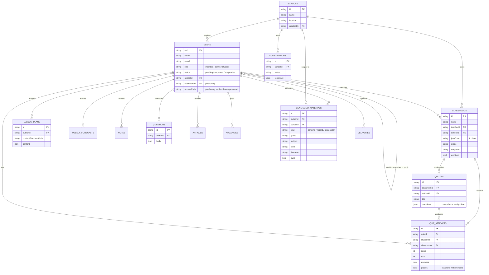
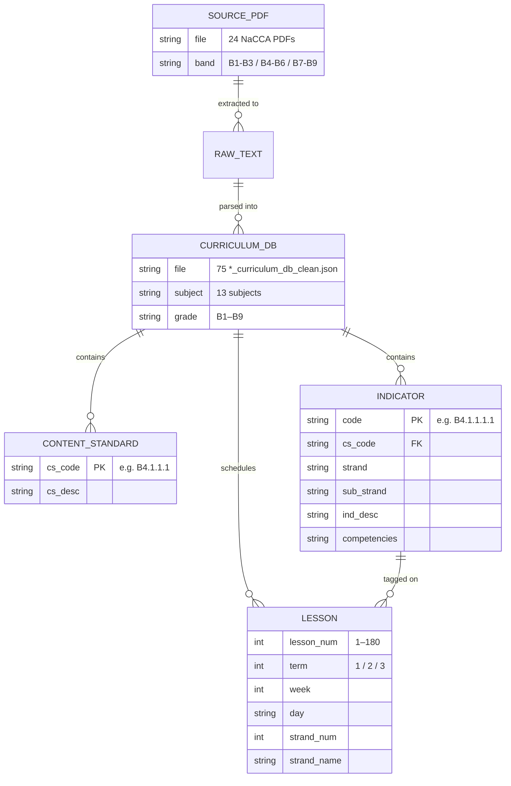
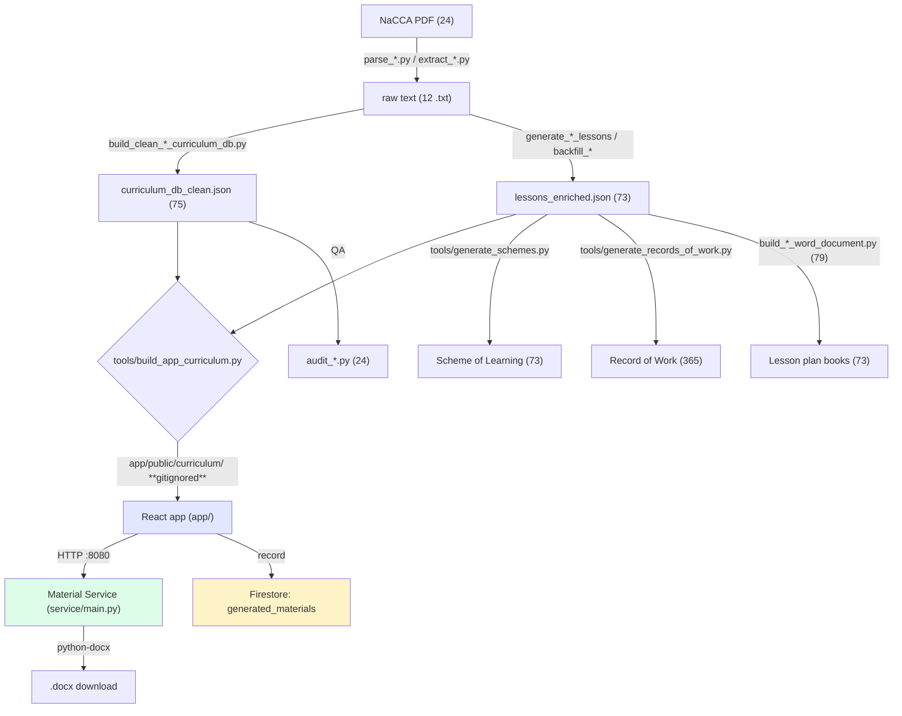

# Beacon Educational Consult — Architecture & Structure

A map of what exists today (commit `8ba94bf`), what the data model looks
like, and how the repository could be restructured.

Diagrams are Mermaid — GitHub renders them inline.

---

## 1. Data model — Firestore (runtime)

15 collections. This is what the live app reads and writes.



### Known weak points in this model

| Issue | Where | Why it matters |
|---|---|---|
| `accessCode` is the pupil's **password**, stored in plaintext | `users` | Readable by anyone who can read the collection |
| `Classrooms.jsx` queries **all** pupils, no classroom filter | `users` | Cross-tenant leak + every teacher downloads the whole table |
| `generated_materials` records metadata but **not the file** | `users`/`schools` | No re-download; history is a receipt, not a library |
| `quizzes.questions` is a snapshot, `questions` is a live bank | `quizzes` | Two sources of truth for question content |

---

## 2. Data model — curriculum (static, in-repo JSON)

This is the asset. It does not live in Firestore; it is built into the app
at deploy time.



### Verified counts

| Metric | Count | Source |
|---|---|---|
| Lesson objects | **13,140** | 73 `*_lessons_enriched.json` |
| Subject-grade books | **73** | one per grade × subject |
| Indicators served by the app | **4,040** | `tools/build_app_curriculum.py` |
| Curriculum DB files | **159** | 75 at root + 84 in `app/data/` |
| Grades served | **11** | KG1, KG2, B1–B9 |
| Source PDFs | **24** | root |

> **On the 4,040 figure** — it is correct. It comes from
> `tools/build_app_curriculum.py`, which counts indicator records per grade
> across all 11 grades. Counting *unique codes* in the source databases
> yields 2,519, a smaller number only because the same code legitimately
> recurs across subject-grades. 4,040 is what the app actually serves, so
> it is the honest figure for any claim about the library.

> ⚠️ **Curriculum data lives in two places.** 75 `*_curriculum_db_clean.json`
> files sit at the repo root and 84 more in `app/data/`. `DB_SEARCH` in
> `tools/generate_schemes.py` searches both. This is the single most
> important fact to know before moving any data — a restructure that moves
> only the root files will silently drop the KG grades and several subjects.

---

## 3. Pipeline — how a document gets made



Two runtimes:

| Runtime | Stack | Job |
|---|---|---|
| **Studio** (offline, this repo) | Python + python-docx | Parse curricula, build the library, emit books |
| **Portal** (live) | React + Vite + Firestore | Serve teachers, generate on demand |

The Material Service exists because the browser cannot run `python-docx`.
It is the seam between the two.

---

## 4. Repository structure today

986 tracked files:

| Location | Files | Share |
|---|---:|---:|
| **repo root** | **464** | **47%** |
| `app/` | 499 | 51% |
| `docs/` | 9 | 1% |
| `tools/` | 7 | 1% |
| `service/` | 4 | — |
| `sales/`, `marketing/` | 3 | — |

The root pile, broken down:

| Category | Count | Verdict |
|---|---:|---|
| `*.json` data | 233 | **should be under `data/`** |
| `build_*.py` book generators | 79 | **should be under `tools/`** |
| `audit_*.py` + results | 24 | **should be under `tools/`** |
| `*.pdf` source curricula | 24 | **should be under `data/source/`** |
| `generate_*.py` | 23 | **should be under `tools/`** |
| `backfill_*.py` | 16 | **should be under `tools/`** |
| `parse_*`/`extract_*.py` | 17 | **should be under `tools/`** |
| One-off scratch scripts | 28 | **should be deleted** |
| `*.txt` raw PDF dumps | 12 | **should be under `data/`** |
| `*.docx` built books | 2 | **moved out already** |
| `*.md` | 4 | keep |

Those 28 scratch scripts are extraction debris (none is imported by any
other script — verified):
`print_page6.py`, `print_page10.py`, `print_page11.py`,
`print_page1_text.py`, `inspect_math.py`, `inspect_math_parsed.py`,
`read_notes.py`, `read_math_notes.py`, `scan_cells.py`,
`test_parse.py`, `test_parse_math.py`, `test_structure.py`, …

---

## 5. Is restructuring possible?

**Yes — and it is safe, because git tracks content, not folders.**

`git mv` records a rename. History follows the file. Nothing is lost, no
commit is rewritten, and every existing pointer (branch, tag, PR) keeps
working. The risk is not to history — it is to **paths hardcoded in code**.

### What actually breaks

The 79 `build_*.py` scripts, 17 parser scripts and 23 generators read and write
sibling paths at the repo root. Move the JSON and they all break.

Mitigation: give the data layer **one** module that resolves paths, and
have every script import it. Then the move is a one-line change.

```python
# data/paths.py
from pathlib import Path
ROOT = Path(__file__).resolve().parent.parent
DATA = ROOT / "data"
SOURCES = DATA / "sources"      # the 24 PDFs
RAW     = DATA / "raw"          # the 12 .txt dumps
DB      = DATA / "curriculum"   # the 75 *_curriculum_db_clean.json
LESSONS = DATA / "lessons"      # the 73 *_lessons_enriched.json
```

### Target structure

```
staff-common-room/
├── app/                        # React portal (unchanged)
├── service/                    # Material Service (unchanged)
├── tools/                      # every .py in the repo
│   ├── generators/             #   build_*.py (79)
│   ├── parsers/                #   parse_*.py, extract_*.py (17)
│   ├── backfill/               #   backfill_*.py (16)
│   ├── audit/                  #   audit_*.py (24)
│   ├── generate_schemes.py
│   ├── generate_records_of_work.py
│   └── build_app_curriculum.py
├── data/                       # every .json / .pdf / .txt
│   ├── paths.py                #   single source of truth for paths
│   ├── sources/                #   24 NaCCA PDFs
│   ├── raw/                    #   12 extracted .txt
│   ├── curriculum/             #   75 *_curriculum_db_clean.json
│   └── lessons/                #   73 *_lessons_enriched.json
├── docs/                       # unchanged
├── sales/  marketing/
├── TODO.md
└── README.md
```

Effect: **464 root files → about 8.**

### Suggested sequence

| Step | Action | Risk |
|---|---|---|
| 0 | Delete the 28 scratch scripts (verify none are imported first) | None — they are dead |
| 1 | Create `data/paths.py` | None |
| 2 | `git mv` the data into `data/` | Low — breaks paths until step 3 |
| 3 | Update the ~154 scripts to import `paths.py` | **Medium — the real work** |
| 4 | `git mv` the `.py` files into `tools/` | Low |
| 5 | Fix imports/relative paths in moved scripts | Low |
| 6 | Regenerate a book + run `tools/validate_app_curriculum.py` | Verification |
| 7 | `yarn build` | Verification |

Steps 0–2 are mechanical and reversible. **Step 3 is the only genuinely
labour-intensive one**, and it can be done script by script, verifying as
you go.

### Recommendation

Do **step 0 now** — deleting 29 dead scratch scripts is free and instantly
makes the repo legible.

Do **not** do steps 1–5 while the sales push is the priority. The
restructure touches ~154 scripts and produces zero revenue. It is worth
doing *because* you will live in this repo for years, but it should happen
in a quiet week, on its own branch, with step 6 as the gate.

The one thing I would fix immediately, regardless: the **4,040 indicator
figure** in `TODO.md`, `docs/APP_CURRICULUM.md` and
`docs/VISUALIZATION_ENGINE.md`. It is wrong, it is in material a school
could read, and it is a two-minute correction.
