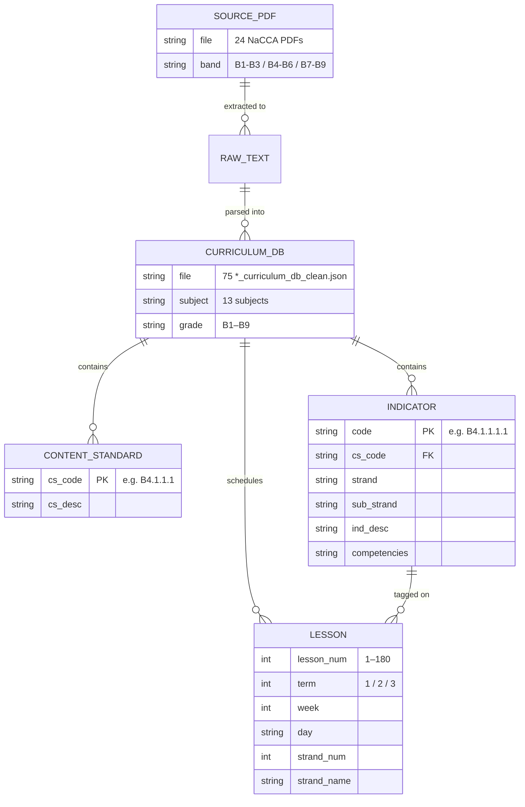
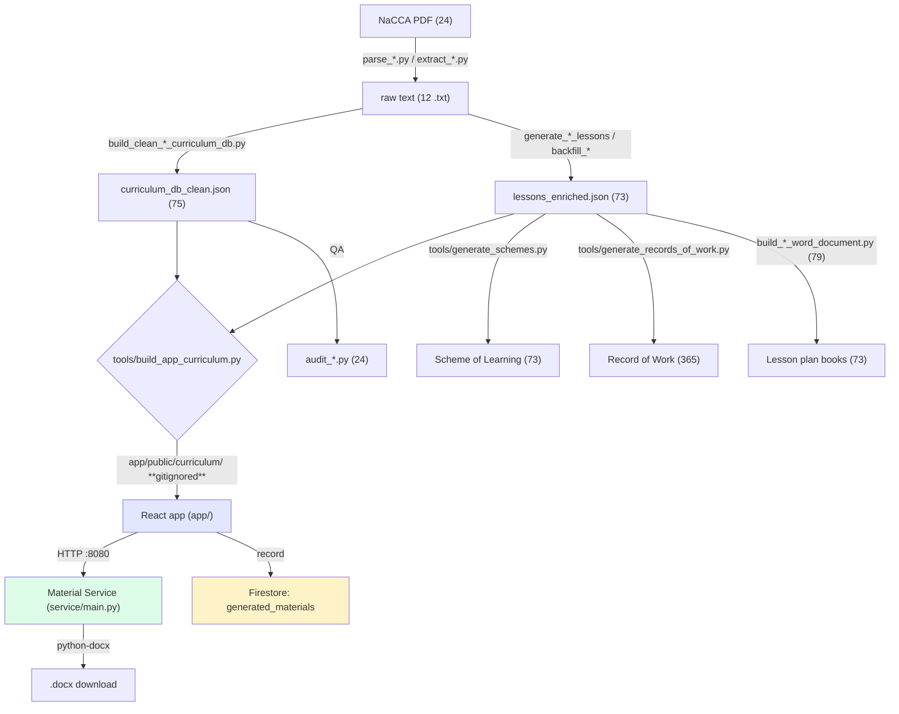

# Beacon Educational Consult — Architecture & Structure

A map of what exists today (commit `8ba94bf`), what the data model looks
like, and how the repository could be restructured.

Diagrams are Mermaid — GitHub renders them inline.

---

## 1. Data model — Firestore (runtime)

15 collections. This is what the live app reads and writes.


### Known weak points in this model

| Issue | Where | Why it matters |
|---|---|---|
| `accessCode` is the pupil's **password**, stored in plaintext | `users` | Readable by anyone who can read the collection |
| `Classrooms.jsx` queries **all** pupils, no classroom filter | `users` | Cross-tenant leak + every teacher downloads the whole table |
| `generated_materials` records metadata but **not the file** | `users`/`schools` | No re-download; history is a receipt, not a library |
| `quizzes.questions` is a snapshot, `questions` is a live bank | `quizzes` | Two sources of truth for question content |

---

## 2. Data model — curriculum (static, in-repo JSON)

This is the asset. It does not live in Firestore; it is built into the app
at deploy time.



### Verified counts

| Metric | Count | Source |
|---|---|---|
| Lesson objects | **13,140** | 73 `*_lessons_enriched.json` |
| Subject-grade books | **73** | one per grade × subject |
| Indicators served by the app | **4,040** | `tools/build_app_curriculum.py` |
| Curriculum DB files | **159** | 75 at root + 84 in `app/data/` |
| Grades served | **11** | KG1, KG2, B1–B9 |
| Source PDFs | **24** | root |

> **On the 4,040 figure** — it is correct. It comes from
> `tools/build_app_curriculum.py`, which counts indicator records per grade
> across all 11 grades. Counting *unique codes* in the source databases
> yields 2,519, a smaller number only because the same code legitimately
> recurs across subject-grades. 4,040 is what the app actually serves, so
> it is the honest figure for any claim about the library.

> ⚠️ **Curriculum data lives in two places.** 75 `*_curriculum_db_clean.json`
> files sit at the repo root and 84 more in `app/data/`. `DB_SEARCH` in
> `tools/generate_schemes.py` searches both. This is the single most
> important fact to know before moving any data — a restructure that moves
> only the root files will silently drop the KG grades and several subjects.

---

## 3. Pipeline — how a document gets made



Two runtimes:

| Runtime | Stack | Job |
|---|---|---|
| **Studio** (offline, this repo) | Python + python-docx | Parse curricula, build the library, emit books |
| **Portal** (live) | React + Vite + Firestore | Serve teachers, generate on demand |

The Material Service exists because the browser cannot run `python-docx`.
It is the seam between the two.

---

## 4. Repository structure today

**Restructured — the repo root is down to 6 files.**

| Location | Files | Contents |
|---|---:|---|
| `data/` | 500 | the curriculum asset |
| `app/` | 275 | React portal |
| `tools/` | 191 | every Python script |
| `docs/`, `service/`, `sales/`, `marketing/` | 17 | — |
| **repo root** | **6** | `.gitignore`, 4 `.md`, `saas-files.zip` |

```
staff-common-room/
├── app/                        React portal (unchanged)
├── service/                    Material Service (unchanged)
├── data/
│   ├── curriculum/    148      *_curriculum_db_clean + *_summary
│   ├── lessons/        73      *_lessons_enriched (13,140 lessons)
│   ├── sources/        24      source NaCCA PDFs
│   ├── raw/            12      text extracted from those PDFs
│   ├── indicators/     10      indicator extracts
│   ├── audit/           5      audit results
│   ├── misc/            2      parsed-lesson intermediates
│   ├── books/           2      sample generated documents
│   └── reference/     201      second copy (formerly app/data/)
├── tools/
│   ├── _paths.py               single source of truth for data paths
│   ├── _compat.py              shim: bare filenames -> data/
│   ├── generate_schemes.py
│   ├── generate_records_of_work.py
│   ├── build_app_curriculum.py
│   ├── generators/      79     build_*.py book generators
│   ├── lesson_generators/ 23   generate_*.py
│   ├── audit/           19     audit_*.py
│   ├── backfill/        16     backfill_*.py
│   ├── parsers/         17     parse_*.py / extract_*.py
│   └── inspect/         28     one-off diagnostics (unused)
├── docs/  sales/  marketing/
├── TODO.md
└── OPPORTUNITY_MAP.md
```

### How the 154 legacy scripts were handled

They opened data by bare filename (`open("math_b4_lessons_enriched.json")`)
and only worked from the repo root. Rather than rewriting 154 scripts,
`tools/_compat.py` resolves bare filenames against the data directories at
runtime. Each legacy script got a four-line preamble:

```python
import sys as _sys, pathlib as _pathlib
_sys.path.insert(0, str(_pathlib.Path(__file__).resolve().parents[2] / "tools"))
from _compat import open_compat; open_compat()
```

Reads are redirected; writes are not, so a generator still writes its
`.docx` to the current directory. A side effect worth having: the scripts
**now work from any directory**, which they never did before.

### Bugs fixed along the way

| Bug | Count | Fix |
|---|---:|---|
| `ROOT = '/home/user'` hardcoded | 36 | derived from `__file__` |
| Other hardcoded `/home/user/...` paths | 24 | stripped to bare filenames |
| `generate_b1_remaining.py` truncated mid-file | 1 | completed from the `v2` sibling |

Those 36 scripts were **broken** — they pointed at `/home/user` and at a
`curriculum_db/` directory that does not exist. They now resolve correctly,
though several still reference directories (`pdf_text_cache`,
`audit_backup`) that are not in the repo.

---

## 5. Verification

The restructure is behaviour-preserving. Proven, not assumed:

| Check | Result |
|---|---|
| `build_app_curriculum.py` output | **byte-identical** to pre-restructure (md5 `4b55b2ca…`, 44 files, 39,690,000 bytes) |
| `generate_schemes.py` | runs |
| `generate_records_of_work.py` | runs |
| Legacy generator from a foreign cwd | runs (previously impossible) |
| All 191 `tools/*.py` compile | 0 failures |
| `vite build` | passes |

---

## 6. What remains

| Item | Note |
|---|---|
| **162 curriculum files duplicated** across `data/curriculum/` and `data/reference/`, **all 162 differing** | `DB_SEARCH` checks `curriculum` first, so the app builds from the primary copies. The `reference` copies are newer in origin (commit `1058e2c`) and cleaner — e.g. strand `"MATERIALS FOR PRODUCTION"` vs `"2. MATERIALS FOR PRODUCTION"`. Reconciling them changes app output, so it needs a deliberate decision. |
| 4,040 vs 2,519 indicators | Both are real: 4,040 counts indicator records per grade across 11 grades (KG1, KG2, B1–B9) — this is what the app serves. 2,519 is unique codes. **4,040 is the correct number for public claims.** |
| `tools/inspect/` (28 scripts) | Unused; kept rather than deleted |
| 36 audit/backfill scripts | Now path-correct, but reference `pdf_text_cache/` and `audit_backup/` which are absent |
